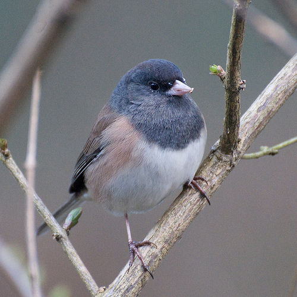
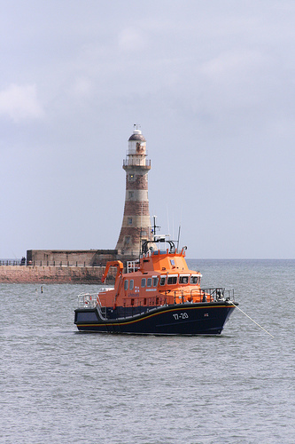

   

   Название модели(№ картинки)   |   C++(синхронный режим)   |  C++(асинхронный режим)   |   Python(синхронный режим)   |  Python(асинхронный режим)       
-------------------|-------------------------|-------------------------|----------------------------|--------------------------
  alexnet(1)  |  data2  |  data3  |   |
  alexnet(2)  |  data2  |  data3  |   |
  alexnet(3)  |  data2  |  data3  |   |
  data1  |  data2  |  data3  |   |











